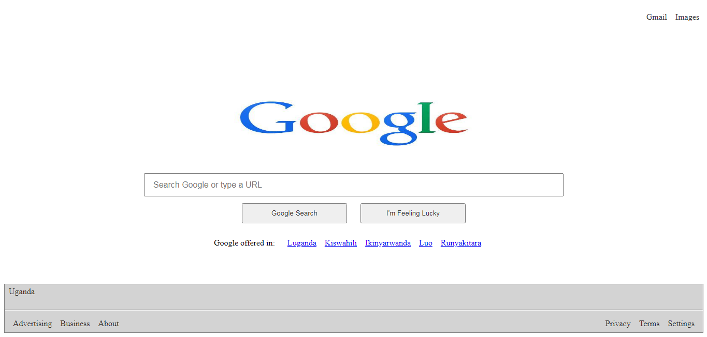

## Google_Search

## Description

A simple google serach page clone designed in HTML5 and CSS3 to showcase how html and css can be used to position and style web pages 

## FEATURES

- View google search page clone

## GOOGLE Page

## Built With

- HTML5
- CSS3

## Live Demo

[Live Demo Link](https://frankopkusianwar.github.io/Google_Search/)

## Getting Started

To get a local copy up and running follow these simple example steps.

### Prerequisites

- web browser e.g chrome

- Code editor e.g VS code

## Instructions

- git clone https://github.com/frankopkusianwar/Google_Search/

### Usage

- Now you can open the index.html file to view the page in browser

## Author

- Okiror Frank

👤 **Okiror Frank**

- Github: [@frankopkusianwar](https://github.com/frankopkusianwar)
- Twitter: [@franko0781](https://twitter.com/franko0781)
- Linkedin: [Okiror Frank](https://linkedin.com/in/frank-okiror)
- Email: okirorfrank3@gmail.com

## 🤝 Contributing

Contributions, issues and feature requests are welcome!

Feel free to check the [issues page](issues/).

## Show your support

Give a ⭐️ if you like this project!
